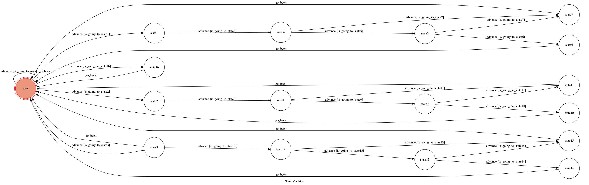

# TOC Project 2018 

CASABLANCA CHAT BOT

F74036085 陳亮廷 

## chatbot

### Programming Language
* Python 3

### Development Environment
* WINDOWS MICROSOFT VISUAL STUDIO CODE

### run code

* before running the code 
  set the`API_TOKEN` and `WEBHOOK_URL` in app.py  to proper values.
```sh
python3 app.py
```

### interact with chatbot

#### A CHATBOT THAT INTRODUCES THE FILM CASABLANCA

#### INITIAL STATE：
* after running the pogramme, user can type "hello" and interact with the bot

* type "about" so that the bot will show you the IMDB site for CASABLANCA
* type "quotes"、"actors" or "video"，
  then it will send you into corresponding states
  
#### AFTER TYPING  qoutes
* It will ask you to enter the characters' name (rick,ilsa,sam,pianist)

* user types rick and the bot will answer Rick's quote to you. And then type ilsa-->sam (or pianist)to see more quotes
  type see you if you don't wish to see more of the quotes
  back to initial state
  
#### type "actors"：
* it will ask you to type the name of the characters
  順序 -->rick -->ilsa -->sam

* if you don't wish to see more pictures just type see you
  
#### type "video" to listen to some music or video clip


* 順序 : background music --> clip --> 配樂
  and the bot will say: Thx see you
  Thats all.
  
## Finite State Machine


